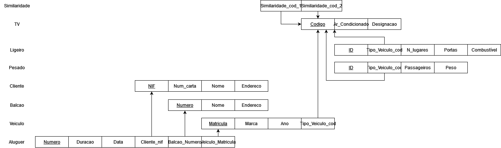
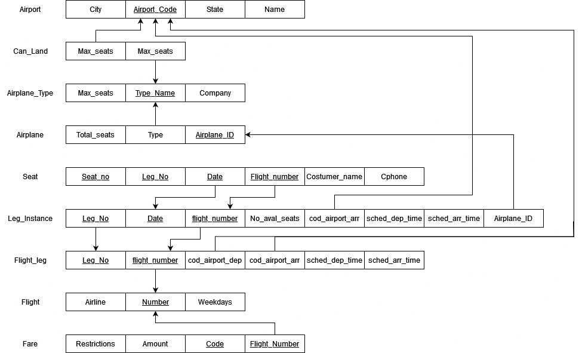
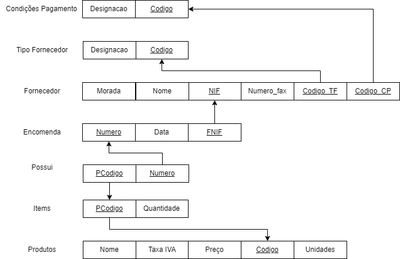
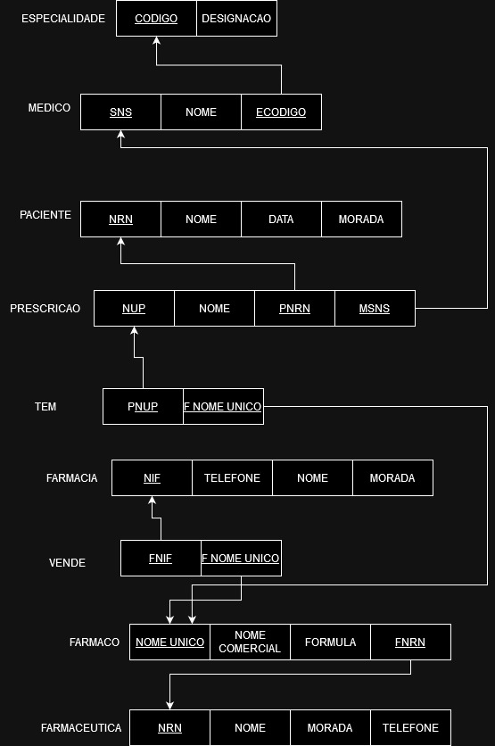
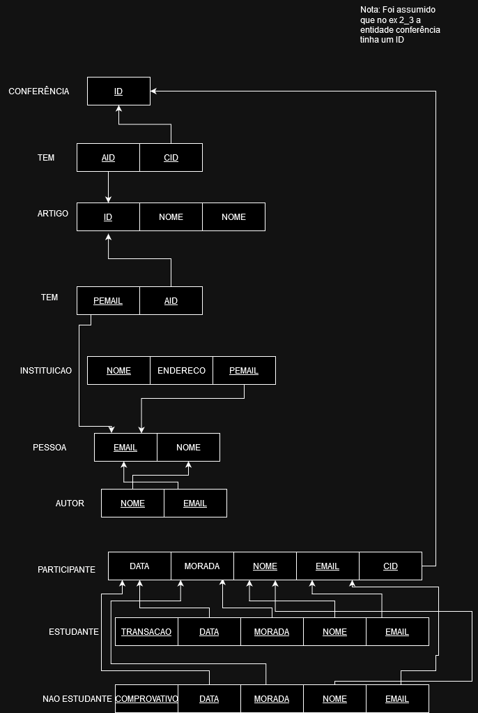
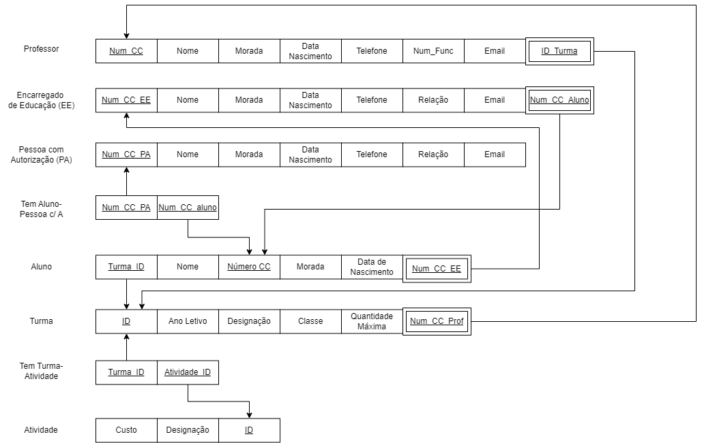

# BD: Guião 3


## ​Problema 3.1
 
### *a)*

```
    Cliente: NIF,nome,endereco,num_carta

    Aluguer: numero,duracao,data

    Balcao: nome,numero,endereco

    Veiculo: matricula,ano,marca

    Tipo Veiculo: designacao,arcondicionado,codigo

    Similiraridade: Tipo_Veiculo_codigo1,Tipo_Veiculo_codigo2

    Ligeiro: designacao,arcondicionado,codigo,numlugares,portas,combustivel

    Pesado: designacao,arcondicionado,codigo,peso,passageiros
```


### *b)* 

```
Chaves Candidatas:
CLIENTE: num_carta,NIF

ALUGUER: numero

BALCAO: numero

VEICULO: matricula

TIPO_VEICULO: codigo

LIGEIRO: codigo

PESADO: codigo

-----------------------------------------------------------------------------------

Chaves Primárias:
CLIENTE: NIF

ALUGUER: numero

BALCAO: numero

VEICULO: matricula

TIPO_VEICULO: codigo

LIGEIRO: codigo

PESADO: codigo


-----------------------------------------------------------------------------------

Chaves Estrangeiras:
ALUGUER: - NIF (CLIENTE)
         - numero (BALCAO)
         - matricula (VEICULO)

VEICULO: codigo (TIPO_VEICULO)

Similaridade: codigo (TIPO_VEICULO)

```


### *c)* 




## ​Problema 3.2

### *a)*

```
    

    AIRPORT:Airport_code,City,State,Name 
    
    
    CAN_LAND: -Airport_code (AIRPORT)
              -Type_name (AIRPLANE_TYPE)

    AIRPLANE_TYPE: Company,Type_name,Max_seats

    AIRPLANE:Airplane_id,Total_no_of_seats,AIRPLANE_TYPE

    LEG_INSTANCE: No_of_avail_seats,Date,AIRPLANE

    SEAT: Seat_no,Customer_name,Cphone

    FLIGHT:Airline,Weekdays,Number 

    FLIGHT_LEG = Leg_no,Scheduled_dep_time,Scheduled_arr_time,AIRPORT,LEG_INSTANCE,FLIGHT

    FARE: Restrictions,Amount,Code,FLIGHT

    
```


### *b)* 

```
Chaves Candidatas:
AIRPORT: Name,Airport_code

CAN_LAND: -Airport_code (AIRPORT)
          -Type_name (AIRPLANE_TYPE)

AIRPLANE_TYPE: Type_name

AIRPLANE: Airplane_id
         
LEG_INSTANCE: Date

SEAT: Seat_no, Customer_name

FLIGHT: Number

FLIGHT_LEG: Leg_no

FARE: Code
-----------------------------------------------------------------------------------

Chaves Primárias:
AIRPORT: Airport_code

AIRPLANE: Type_name

LEG_INSTANCE: Date

SEAT: Seat_no

FLIGHT_LEG: Leg_no

FLIGHT: Number

FARE: Code

-----------------------------------------------------------------------------------

Chaves Estrangeiras:
AIRPLANE: Type_name (AIRPLANE_TYPE)

LEG_INSTANCE: Airplane_id,Type_name (AIRPLANE)

FLIGHT_LEG: - Airport_code(AIRPORT)
            - Date,Airplane_id,Type_name(LEG_INSTANCE)
            - Number(FLIGHT)

FARE: Number (FLIGHT)

```


### *c)* 




## ​Problema 3.3


### *a)* 2.1



### *b)* 2.2



### *c)* 2.3



### *d)* 2.4

