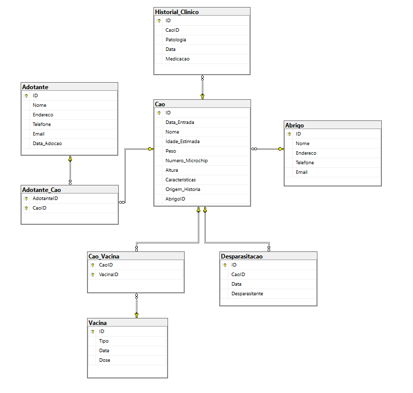

# BD: Proposta Projeto Canil P10G6

## Breve Introdução

Construção de uma base de dados capaz de albergar as entradas e saídas de animais num abrigo animal localizado na Praia de Mira, Coimbra (projeto depois será usado pela instituição que pediu ajuda através de contactos).

### Análise de Requisitos

```
Campos Obrigatórios:

O sistema deve exigir que os funcionários do abrigo preencham campos essenciais durante a admissão de um cão. Esses campos incluem:
Nome,
Número de chegada: Identificação única do animal, atribuído automaticamente,
Data de Entrada: Registro da data em que o cão entrou no abrigo,
Peso: Peso atual do cão,
Número de Microchip: Identificação eletrónica para rastreamento do cão.

Vacinação:
O sistema deve permitir o registro das vacinas administradas a cada cão. Isso inclui:
Tipo de Vacina: Informações sobre a vacina específica (por exemplo, antirrábica, contra tosse do canil).
Data da Vacinação: Data em que a vacina foi aplicada.

Desparasitação:
O sistema deve rastrear os tratamentos de desparasitação internos e externos realizados em cada cão. Isso envolve:
Desparasitante Utilizado: Nome do produto ou método utilizado.
Data da Desparasitação: Data em que o tratamento foi realizado.

Não Obrigatório mas Importante:

Características do Cão:

O sistema deve permitir que os funcionários registrem características específicas de cada cão. Isso pode incluir:
Temperamento: Comportamento geral do cão (por exemplo, amigável, tímido, agressivo).
Outras Características: Informações adicionais relevantes (por exemplo, pelagem, cor dos olhos).

Origem/História:

É importante coletar informações sobre a origem e a história de cada cão. Isso pode incluir:
Origem do Cão: De onde o cão veio (por exemplo, resgatado da rua, entregue por um proprietário).
História do Cão: Qualquer informação relevante sobre o passado do cão (por exemplo, maus-tratos, experiências anteriores).
```


### Modelo de Entidade-Relacionamento



### Diagrama Entidade-Relacionamento

```
Entidades: Cão, Abrigo, Historial_Clinico, Vacina, Desparasitação e Adotante

Atributos: Data_Entrada, Nome, Idade estimada, Peso, Número de microchip, Altura, Características, Origem/História (Entidade Cão)
           Nome, Endereço, Telefone, Email (Entidade Abrigo)
           Patologia, Data, Medicação (Entidade Historial_Clinico)
           Tipo, Data, Dose (Entidade Vacina)
           Data, Desparasitante (Entidade Desparasitação)
           Nome, Endereço, Telefone, Email, Data_Adoção (Entidade Adotante)
           

Relações da BD: Possui(Relação entre as entidades Abrigo e Cão) Tipo: 1:N
                Possui(Relação entre as entidades Cão e Historial_Clinico) Tipo 1:N
                Tem(Relação entre as entidades Cão e Vacina) Tipo N:M
                Tem(Relação entre as entidades Cão e Desparasitação) Tipo N:M
                Adota(Relação entre as entidades Adotante e Cão) Tipo 1:N
```


