# BD: Trabalho Prático APF-T

**Grupo**: P10G6

- David Palricas, MEC: 108780. Contribuição: 50%
- Pedro Torres, MEC: 108799. Contribuição: 50%

## Link para a demonstração do projeto

https://youtu.be/NxKn4aIKWaU

## Introdução / Introduction

Construção de uma base de dados capaz de albergar as entradas e saídas de animais num
abrigo animal localizado na Praia de Mira, Coimbra (projeto depois será usado pela instituição que pediu ajuda através de contactos). O ficheiro register.cs deve ser alterado de maneira a que seja possível alterar para os dados de admin e a password de admin. O projeto foi desenvolvido em C# e SQL Server.

## ​Análise de Requisitos / Requirements

Campos Obrigatórios:

O sistema deve exigir que os funcionários do abrigo preencham campos essenciais durante a admissão de um cão. Esses campos incluem:
Nome,
Número de chegada: Identificação única do animal, atribuído automaticamente,
Data de Entrada: Registro da data em que o cão entrou no abrigo,
Peso: Peso atual do cão,
Número de Microchip: Identificação eletrónica para rastreamento do cão.

Vacinação:
O sistema deve permitir o registro das vacinas administradas a cada cão. Isso inclui:
Tipo de Vacina: Informações sobre a vacina específica (por exemplo, antirrábica, contra tosse do canil).
Data da Vacinação: Data em que a vacina foi aplicada.

Desparasitação:
O sistema deve rastrear os tratamentos de desparasitação internos e externos realizados em cada cão. Isso envolve:
Desparasitante Utilizado: Nome do produto ou método utilizado.
Data da Desparasitação: Data em que o tratamento foi realizado.

Não Obrigatório mas Importante:

Características do Cão:

O sistema deve permitir que os funcionários registrem características específicas de cada cão. Isso pode incluir:
Temperamento: Comportamento geral do cão (por exemplo, amigável, tímido, agressivo).
Outras Características: Informações adicionais relevantes (por exemplo, pelagem, cor dos olhos).

Origem/História:

É importante coletar informações sobre a origem e a história de cada cão. Isso pode incluir:
Origem do Cão: De onde o cão veio (por exemplo, resgatado da rua, entregue por um proprietário).
História do Cão: Qualquer informação relevante sobre o passado do cão (por exemplo, maus-tratos, experiências anteriores).

## DER - Diagrama Entidade Relacionamento/Entity Relationship Diagram

### Versão final/Final version

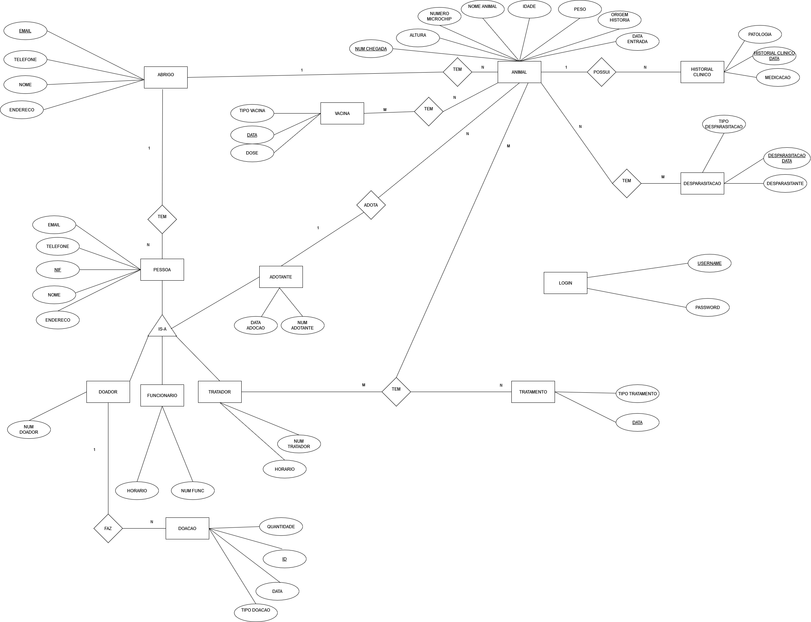

### APFE

Introduzidas nova tabela de modo a possuir um login e registo de utilizadores, permitindo a cada utilizador ter a sua própria conta e assim poderem ser identificados na plataforma e também uma melhor noção de cada tratamento a realizar nos animais em relação a organização da base de dados. Foi também alterada a chave primária da tabela Projeto_Animal.

## ER - Esquema Relacional/Relational Schema

### Versão final/Final Version

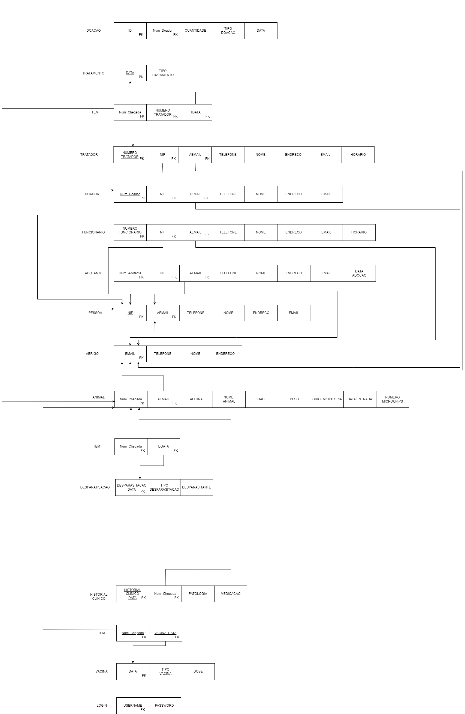

### APFE

Pequenas alterações descritas no DER.

## ​SQL DDL - Data Definition Language

[SQL DDL File](SQL/DDL.sql "SQLFileQuestion")

## SQL DML - Data Manipulation Language

Uma secção por tabela.

[SQL DML File](SQL/DML.sql "SQLFileQuestion")


##  Register e Login

O utilizador regista-se na base de dados com um username e uma palavra-passe. Casos o username já se encontrar registado na base de dados é apresentada uma mensagem a informar que este username já se encontra registado. A palavra passe deve ter um comprimento mínimo de 8 carateres, pelo menos 1 letra maiúscula e 1 número, sendo esta verificação realizada no forms. Caso o utilizador tenha respeitado todas as restrições aplicadas, os seus dados serão inseridos na tabela Projeto_Login, sendo a palavra passe encriptada usando o algoritmo SHA-256 por via de uma UDF designada HashPassword.


```sql
CREATE FUNCTION dbo.HashPassword(@password NVARCHAR(128))
RETURNS VARCHAR(128)
AS
BEGIN
    DECLARE @hashedPassword VARCHAR(128);
    SET @hashedPassword = CONVERT(VARCHAR(128), HASHBYTES('SHA2_256', @password), 2); -- SHA-256 hashing algoritmo
    RETURN @hashedPassword;
END;

Go
```

O Login é feito de acordo com os inputs "das caixas de texto do forms", verificando se o utilizador existe na base de dados, caso  este não exista é apresentada uma mensagem a informar que aquele utilizador não existe na base de dados. É também usada uma stored procedure para verificar a palavra passe, sendo esta verificação feita encriptando a palavre passe inserida pelo utilizador usando o mesmo algoritmo da UDF HashPassword e comparando com a palavre passe encriptada na base de dados a que corresponde um certo username que está associado a essa palavra-passe. Se as palavras-passes forem diferentes o utilizador não consegue autenticar-se no sistema, recebendo feedback.

```sql
CREATE PROCEDURE VerifyPassword
    @username NVARCHAR(50),
    @password NVARCHAR(128),
    @isValid BIT OUTPUT
AS
BEGIN
    DECLARE @storedHash VARCHAR(64);
    DECLARE @inputHash VARCHAR(64);

    -- Recupera o hash armazenado do banco de dados
    SELECT @storedHash = Password
    FROM Projeto_Login
    WHERE Username = @username;

    -- Gera o hash da senha fornecida
    SET @inputHash = dbo.HashPassword(@password);

    -- Compara os hashes
    IF @storedHash = @inputHash
        SET @isValid = 1;
    ELSE
        SET @isValid = 0;
END;
GO
```


Caso o utilizador exista na base de dados:

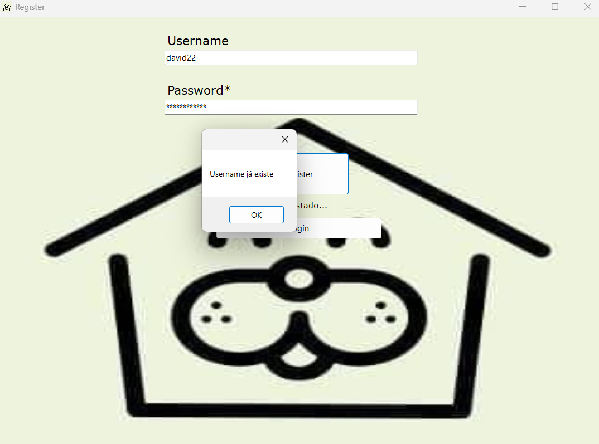

Restrição de Palavra Passe:

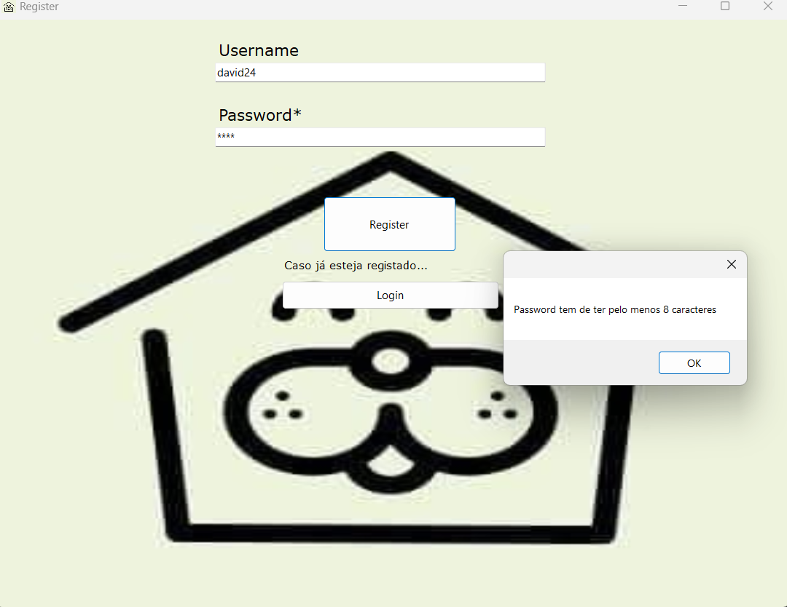

Registo com Sucesso : 

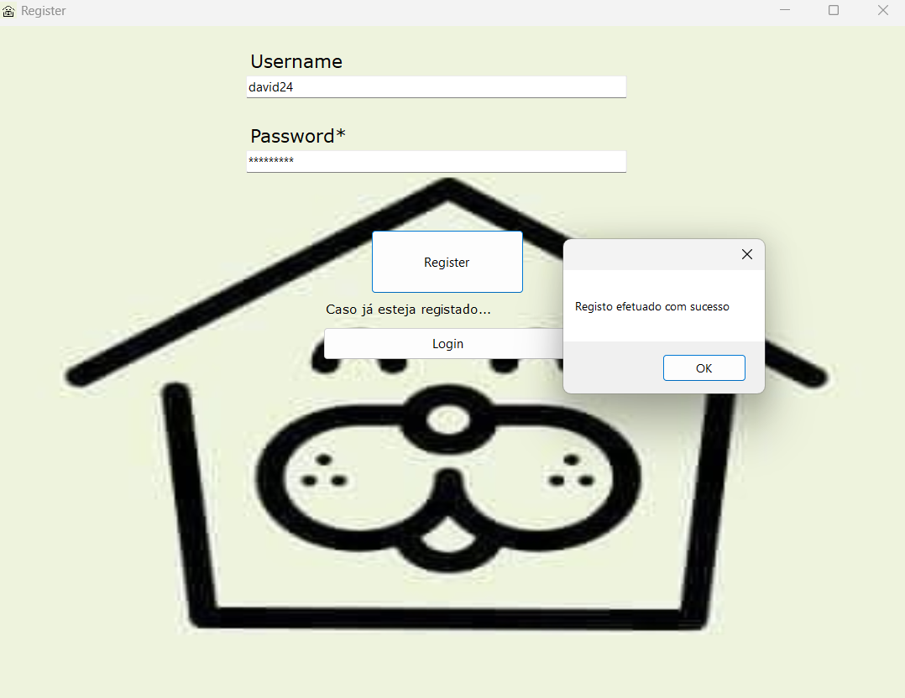

Caso o utilizador não exista na base de dados:

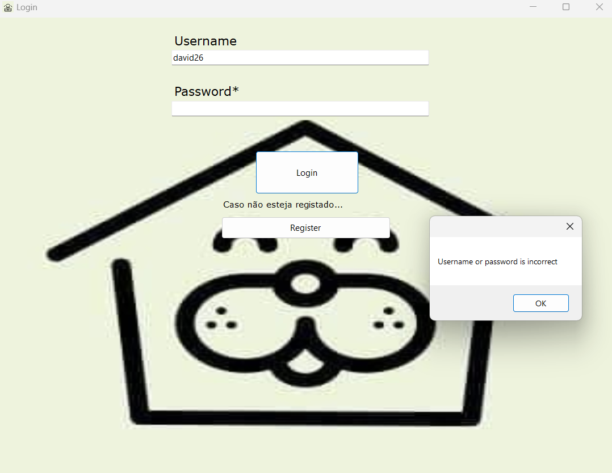

## Funcionalidade: Adicionar animal

É possível ao abrigo adicionar um novo animal que vai ser possível posteriormente adicionar diversos tratamentos diferentes.

```sql
INSERT INTO Projeto_Animal (Nome_Animal, Num_chegada, Altura, Idade, Peso, Origem_Historia, Data_Entrada, Numero_Microchip, AEMAIL,Adotante_NIF) VALUES
```
Adicionando o animal é possível verificar a seguinte mensagem:

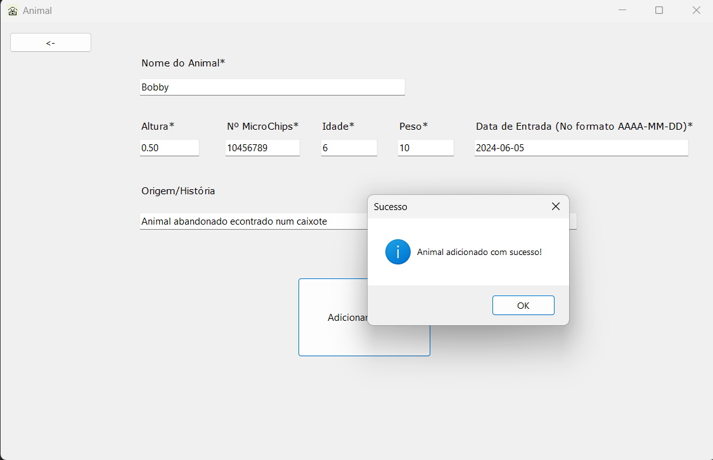

## Gerir Funcionários/Tratadores
Para adicionar ou remover Funcionários/Tratadores foram criadas stored procedures para cada ação, fazendo distinção entre entidades. As stored procedure de remoção de dados de cada entidade possui uma transaction para verificar que esta operação teve sucesso e, caso não tenha, é emitida uma mensagem de erro. As stored procedure de adicionar dados a cada entidade verificam através das chaves primárias se este Funcionário/Tratador já está registado no sistema, se estiver, é apresentada uma mensagem de erro. Caso contrário, as informações são corretamente inseridas nas tabelas. Os números de animal, funcionário, tratador, adotante e doador são autoincrementados.

```sql
CREATE PROCEDURE AddFuncionario
    @Num_Func INT,
    @NIF_Func BIGINT,
    @Abrigo_Email VARCHAR(128),
    @Telefone VARCHAR(20),
    @Nome VARCHAR(128),
    @Endereco VARCHAR(1024),
    @Email VARCHAR(128),
    @Horario DATETIME,
    @Success BIT OUTPUT
AS
BEGIN
  
    SET @Success = 1

    -- Verifica se o NIF_Func já existe
    IF EXISTS (SELECT 1 FROM Projeto_Funcionario WHERE NIF_Func = @NIF_Func)
    BEGIN
         SET @Success = 0
    END
    ELSE
    BEGIN
        -- Insere um novo registro na tabela Projeto_Funcionario
        INSERT INTO Projeto_Funcionario (Num_Func, NIF_Func, Abrigo_Email, Telefone, Nome, Endereco, Email, Horario)
        VALUES (@Num_Func, @NIF_Func, @Abrigo_Email, @Telefone, @Nome, @Endereco, @Email, @Horario)
        
    END
END;

CREATE PROCEDURE RemoveFuncionario
    @Num_Func INT
AS
BEGIN
   
    BEGIN TRANSACTION;
    BEGIN TRY
        
        DELETE FROM Projeto_Funcionario
        WHERE Num_Func = @Num_Func;

       
        COMMIT TRANSACTION;
    END TRY
    BEGIN CATCH
       
        ROLLBACK TRANSACTION;
    END CATCH;
END;
```

```sql
CREATE PROCEDURE AddTratador
    @Num_Tratador INT,
    @NIF_Tratador BIGINT,
    @Abrigo_Email VARCHAR(128),
    @Telefone VARCHAR(20),
    @Nome VARCHAR(128),
    @Endereco VARCHAR(1024),
    @Email VARCHAR(128),
    @Horario DATETIME,
    @Success BIT OUTPUT
AS
BEGIN
    SET @Success = 1

    -- Verifica se o NIF_Tratador já existe
    IF EXISTS (SELECT 1 FROM Projeto_Tratador WHERE NIF_Tratador = @NIF_Tratador)
    BEGIN
         SET @Success = 0
    END
    ELSE
    BEGIN
        -- Insere um novo registro na tabela Projeto_Tratador
        INSERT INTO Projeto_Tratador (Num_Tratador, NIF_Tratador, Abrigo_Email, Telefone, Nome, Endereco, Email, Horario)
        VALUES (@Num_Tratador, @NIF_Tratador, @Abrigo_Email, @Telefone, @Nome, @Endereco, @Email, @Horario)
    END
END;


CREATE PROCEDURE RemoveTratador
    @NIF_Tratador BIGINT
AS
BEGIN
    BEGIN TRY
        BEGIN TRANSACTION;
        
        DELETE FROM Projeto_Tratador
        WHERE NIF_Tratador = @NIF_Tratador;

        COMMIT TRANSACTION;
        PRINT 'Tratador  removido com sucesso .';
    END TRY
    BEGIN CATCH
        ROLLBACK TRANSACTION;
        PRINT 'Erro na remoçáo com o tratador.';
        PRINT ERROR_MESSAGE();
    END CATCH;
END;
```

Funcionário já registado :

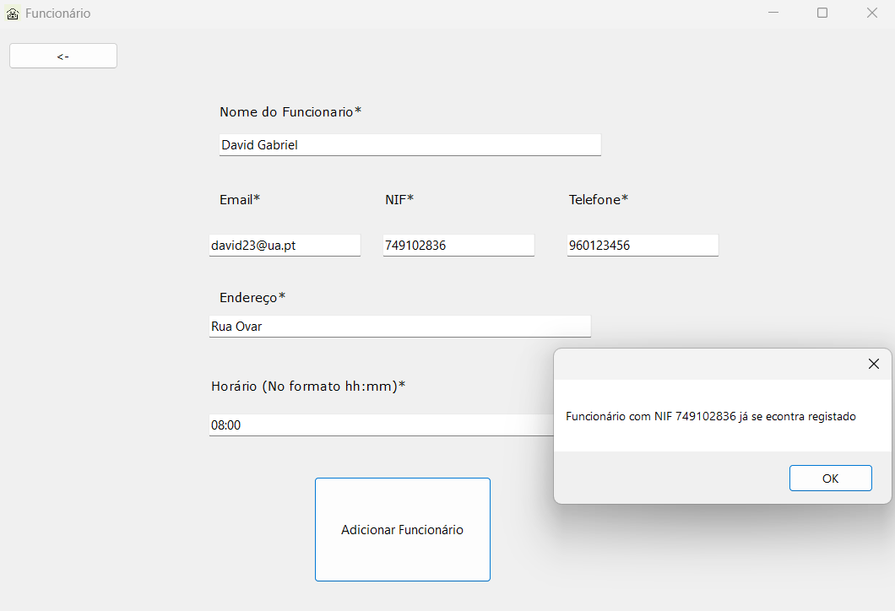

Registo com sucesso de Funcionário: 

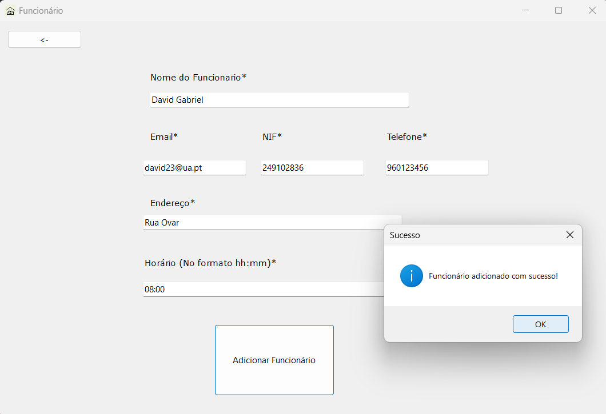

Tentativa de remoção de um Tratador que não existe:

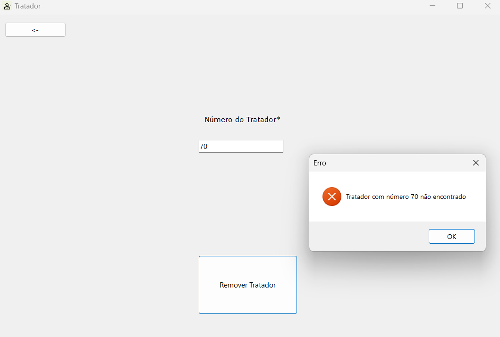

Tratador Removido : 

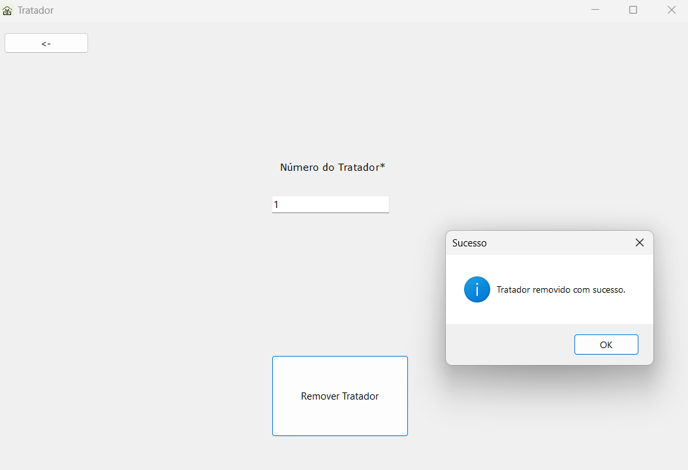


## Serviços
Está disponível uma aba de serviços que dá a possibilidade ao admin para tanto consultar os animais/funcionários como também verificar quais os serviços que é possível realizar num animal. Também foi criada a possibilidade de realizar doações e adoções de maneira a ficar tudo registado.

Menu de Serviços:

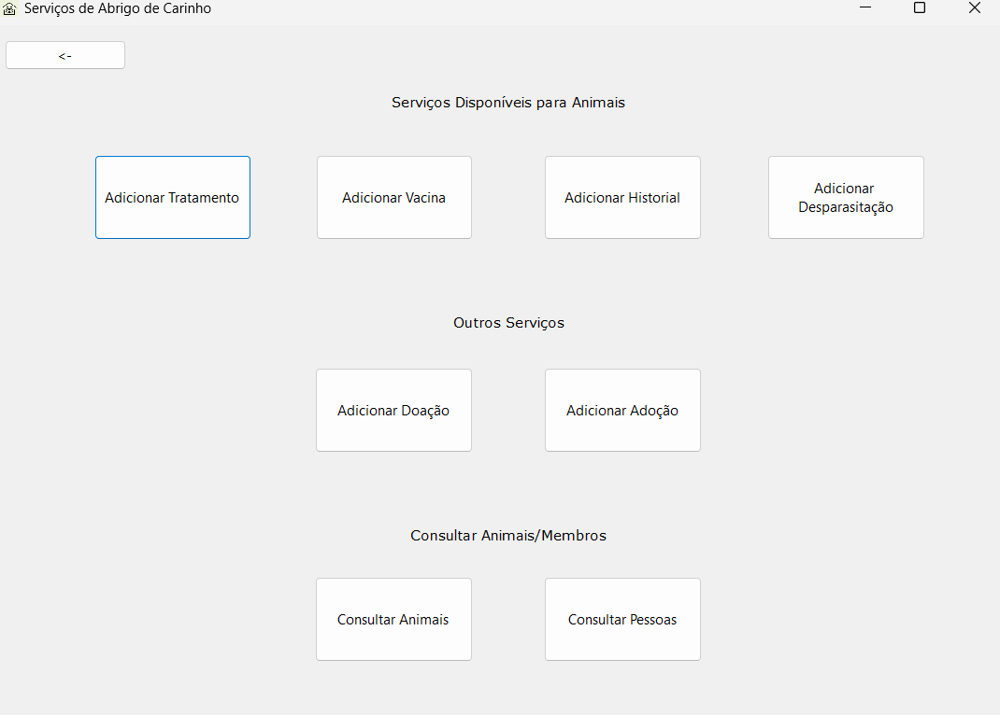

## Funcionalidade: Adicionar serviço animal
Este serviço permite adicionar tratamentos, vacinas e desparasitações a um animal. Para tal, é necessário preencher os campos obrigatórios referentes ao serviço que se pretende adicionar. Caso o tratador que está a realizar o tratamento não exista na base de dados, é apresentada uma mensagem de erro. Caso contrário, os dados são inseridos na tabela correspondente.

```cs
SqlCommand cmdTratadorAnimal = new SqlCommand(
    "INSERT INTO Projeto_Tem_Tratamento_Tratador_Animal (Tratador_NIF, Num_chegada, Tratamento_Data ) VALUES (@nif_tratador, @num_chegada, @tdata)",
    CN
);
cmdTratadorAnimal.Parameters.AddWithValue("@nif_tratador", nif);
cmdTratadorAnimal.Parameters.AddWithValue("@num_chegada", num_chegada_animal);
cmdTratadorAnimal.Parameters.AddWithValue("@tdata", data);
cmdTratadorAnimal.ExecuteNonQuery();
```

```cs
private bool find_tratador(int tratador)
{
    SqlCommand cmd = new SqlCommand("SELECT * FROM Projeto_Tratador WHERE Num_tratador = @tratador", CN);
    cmd.Parameters.AddWithValue("@tratador", tratador);


    SqlDataReader reader = cmd.ExecuteReader();
    if (!reader.HasRows)
    {    reader.Close();
        return false;
    }
    reader.Close();
    return true;
}
```

Tentativa de adicionar um tratamento com um Tratador que não existe:

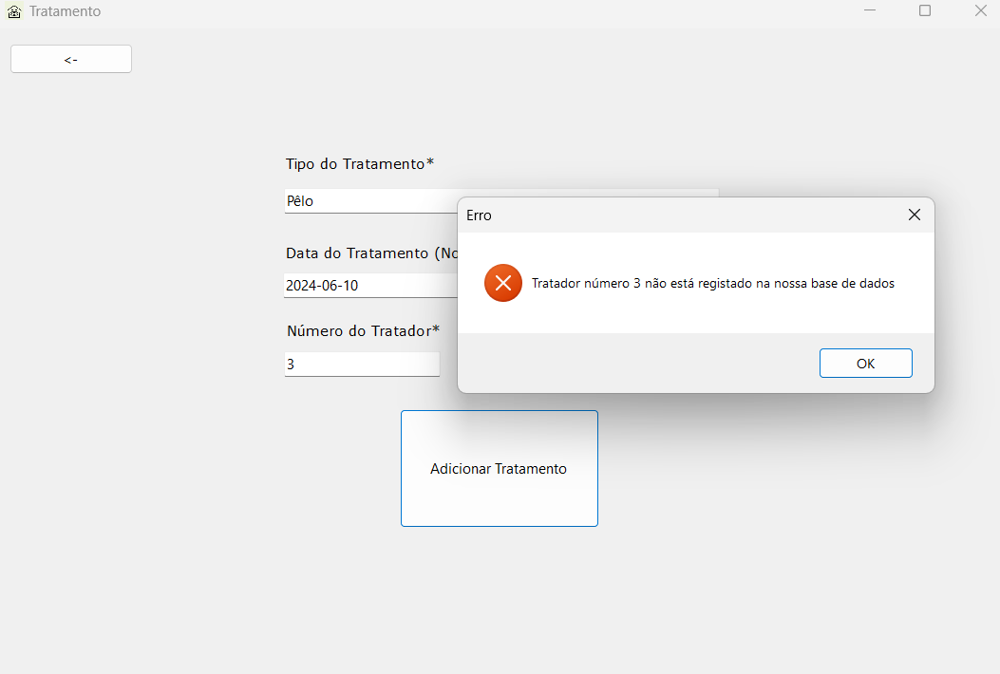
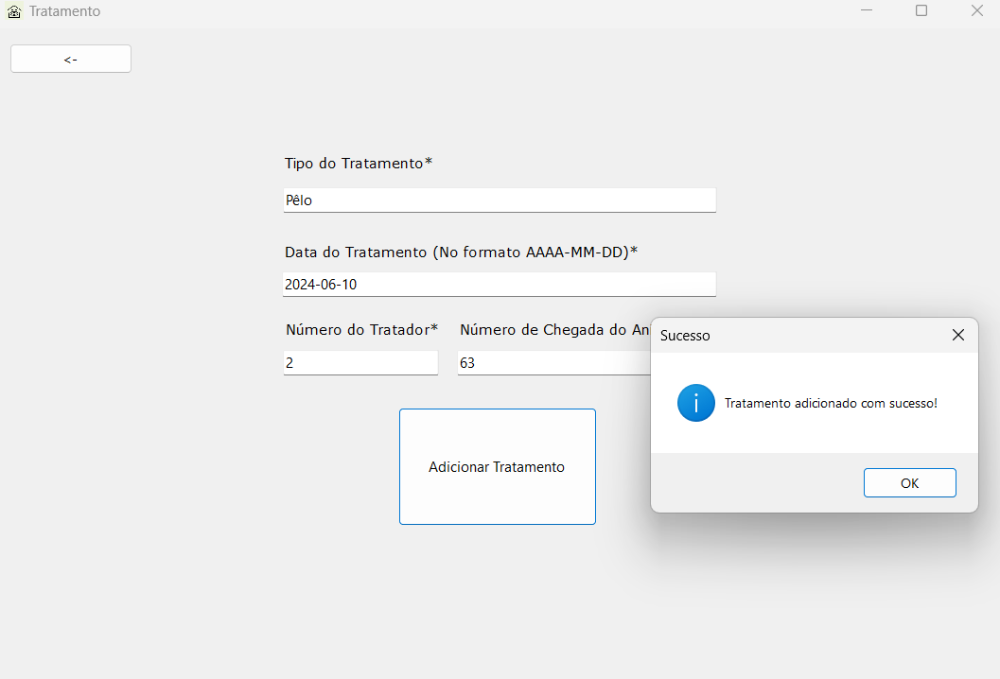
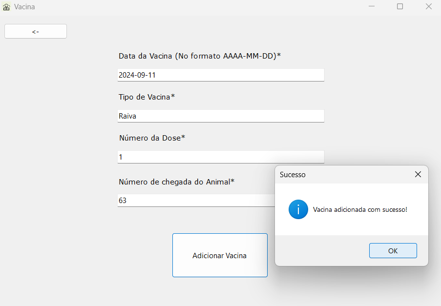
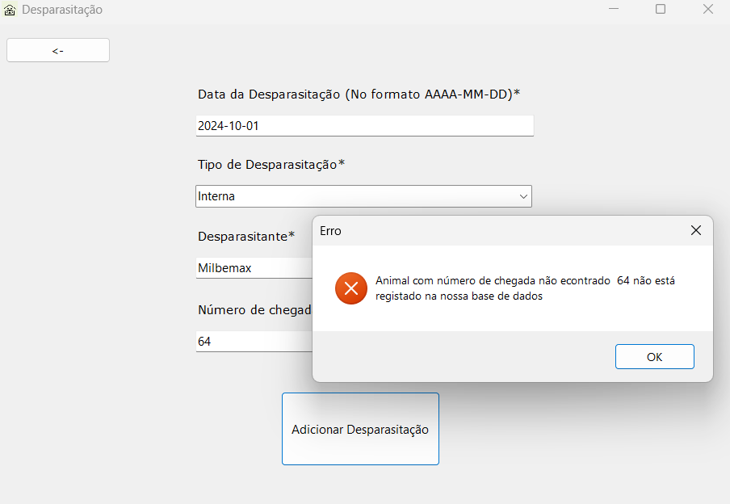


## Funcionalidade: Outros serviços
Como pedido, há a possibilidade de registar adoções e doações. 
Nestes dois serviços, respetivamente, é necessário preencher os dados referentes aos adotantes/doadores. Caso uma destas entidades já esteja previamente registada na base de dados, preenchemos apenas a informação referente ao serviço prestado, caso não esteja são inseridos os dados novos do adotante/doador na tabela correspondente. No caso do adotante esta operação é realizada pelo meio de uma stored procedure.

```sql
CREATE PROCEDURE AtualizarAdotanteNIF @NIF_Adotante BIGINT, @Num_chegada BIGINT
AS
BEGIN
    UPDATE Projeto_Animal
    SET Adotante_NIF = @NIF_Adotante
    WHERE Num_chegada = @Num_chegada;
END;
```

```cs
SqlCommand cmd = new SqlCommand("INSERT INTO Projeto_Doacao (ID, Doador_NIF, Quantidade, Tipo_Doacao, Data) VALUES (@id, @nif, @quantidade, @tipo, @data)", CN);
cmd.Parameters.AddWithValue("@id", doacaoID);
cmd.Parameters.AddWithValue("@nif", Convert.ToInt64(nif_doador.Text));
cmd.Parameters.AddWithValue("@quantidade", Convert.ToInt32(quantidade_input.Text));
cmd.Parameters.AddWithValue("@tipo", tipo_doacao.SelectedItem.ToString());
cmd.Parameters.AddWithValue("@data", data);
```

## Funcionalidade: Consultar animais/membros
Por fim é possível consultar todas as informações associadas ao abrigo.

Inicialmente é possível consultar os animais que estão adotados e os que não estão para que seja possível o abrigo rastrear sempre tudo. É também possível através de uma view inspecionar um animal específico com mais detalhe, evidenciando todo o tipo de tratamentos que o animal já passou por. Por fim, no caso de falecimento de algum animal, é possível remover o animal de todas as tabelas, através de uma transaction, atualizando a tabela referente.

```sql
CREATE VIEW SHOW_ANIMALS AS 
    SELECT 
        Num_chegada, Nome_Animal, Altura, Idade, Peso, Origem_Historia, Data_Entrada, Numero_Microchip, Adotante_NIF
    FROM 
        Projeto_Animal
```

```sql
CREATE VIEW SHOW_ANIMAL AS 
    SELECT 
        pa.Num_Chegada, pt.Tipo_Tratamento, pttta.Tratamento_Data ,Tratador.Num_Tratador, ptv.Vacina_Data, pv.Dose, pv.Tipo_Vacina, phc.Patologia, phc.Medicacao, phc.Historial_Clinico_data,pd.Tipo_Desparasitacao,pd.Desparasitante, pd.Desparasitacao_Data
    FROM 
        Projeto_Animal pa
    LEFT JOIN Projeto_Tem_Tratamento_Tratador_Animal pttta 
        ON 
        pa.Num_chegada = pttta.Num_chegada 
    LEFT JOIN Projeto_Tratamento pt 
        ON 
        pt.data = pttta.Tratamento_Data
    LEFT JOIN  Projeto_Tratador Tratador 
        ON 
        Tratador.NIF_Tratador = pttta.Tratador_NIF
    LEFT JOIN Projeto_Tem_Vacina ptv 
        ON 
        ptv.Num_chegada = pa.Num_chegada 
    LEFT JOIN Projeto_Vacina pv
        ON 
        pv.Data = ptv.Vacina_Data
    LEFT JOIN Projeto_Historial_Clinico phc 
        ON 
        phc.Num_chegada  = pa.Num_chegada
    LEFT JOIN Projeto_TEM_Desparasitacao ptd 
        ON 
        ptd.Num_chegada = pa.Num_chegada
    LEFT JOIN Projeto_Desparasitacao pd 
        ON 
        pd.Desparasitacao_data = ptd.Ddata

GO
```

```sql
-- Show data on the form
BEGIN TRANSACTION;

BEGIN TRY
    DECLARE @Num_chegada BIGINT;

    DELETE FROM Projeto_TEM_Desparasitacao
    WHERE Num_chegada = @Num_chegada;

    DELETE FROM Projeto_Historial_Clinico
    WHERE Num_chegada = @Num_chegada;

    DELETE FROM Projeto_Tem_Vacina
    WHERE Num_chegada = @Num_chegada;

    DELETE FROM Projeto_Animal
    WHERE Num_chegada = @Num_chegada;

    COMMIT TRANSACTION;
    PRINT 'Animal removal transaction completed successfully.';
    
END TRY
BEGIN CATCH

    ROLLBACK TRANSACTION;
    PRINT 'Error occurred during the animal removal transaction.';
    PRINT ERROR_MESSAGE();
END CATCH;
```

Menu de escolha com filtragem entre consultar animais adotados e animais por adotar: 

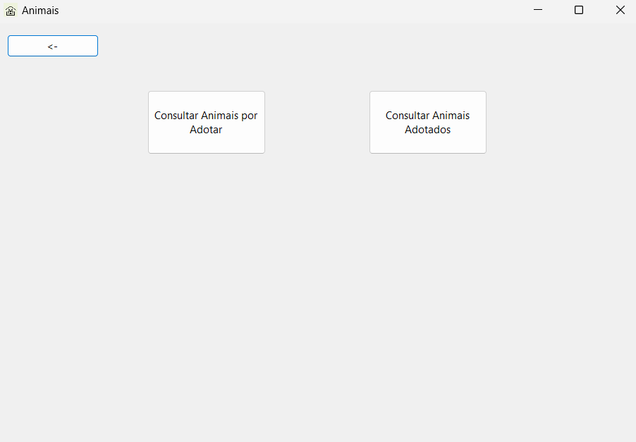

Consulta de Animais por Adotar (Algumas informações Cortadas na imagem):

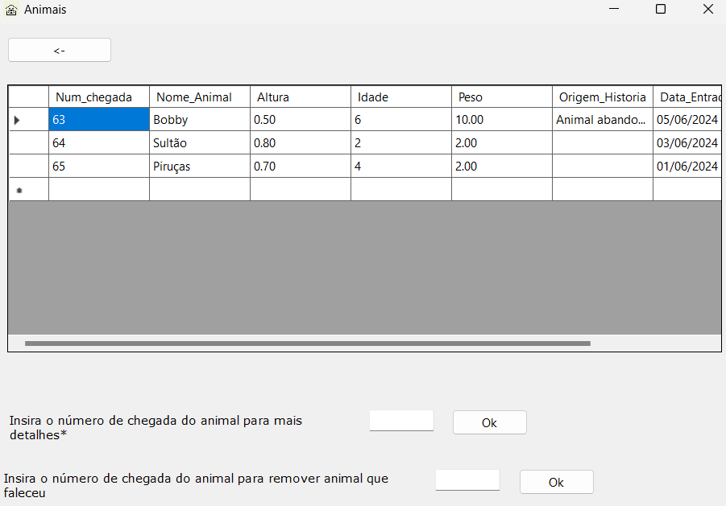


Consulta de Animais Adotados (Algumas informações Cortadas na imagem):

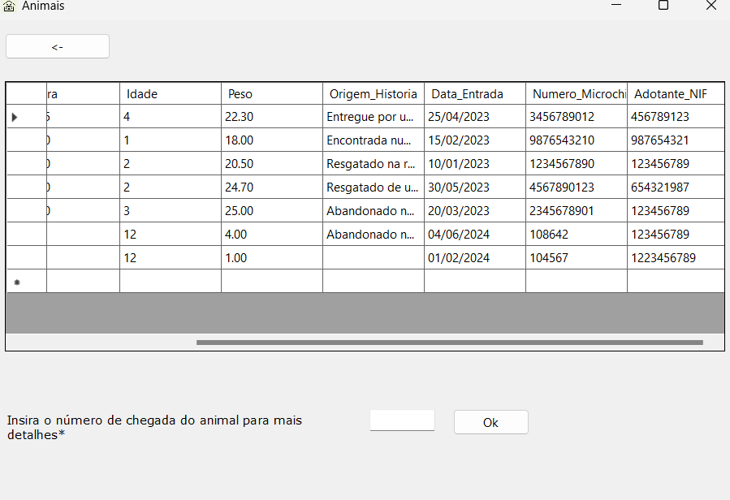

Consulta Detalhada de um Animal(Algumas informações Cortadas na imagem):

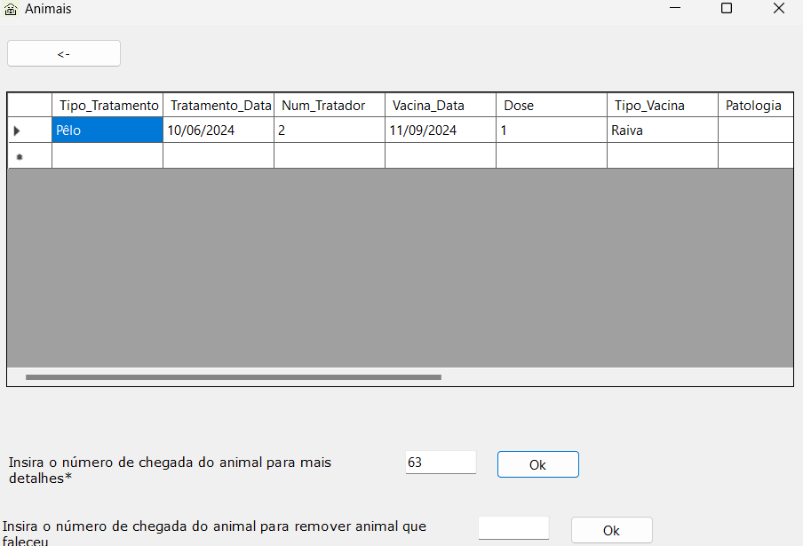


Remoção de um Animal Morto :

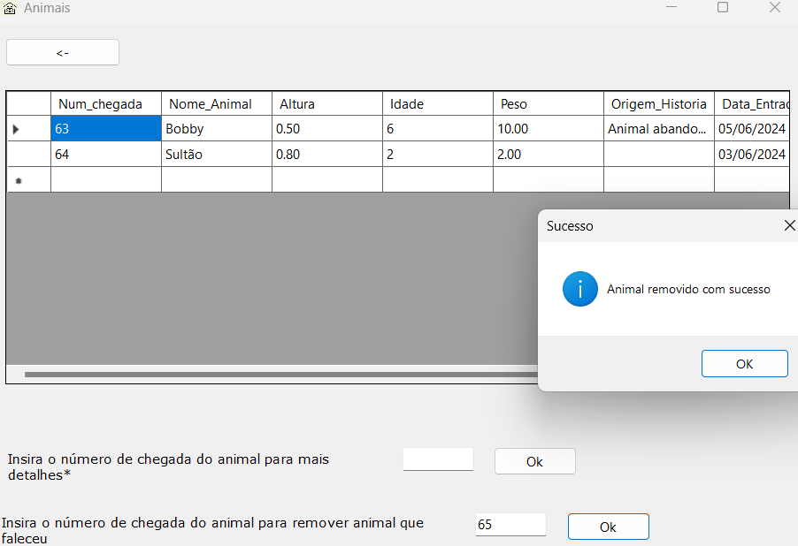

## Funcionalidade: Consultar pessoas

Esta funcionalidade desdobra-se em 4, já que é possível consultar funcionários, doadores, tratadores e adotantes nesta mesma página, simplesmente selecionando o botão referente ao que o utilizador deseja consultar na base de dados.

Menu de Consulta de Pessoas:

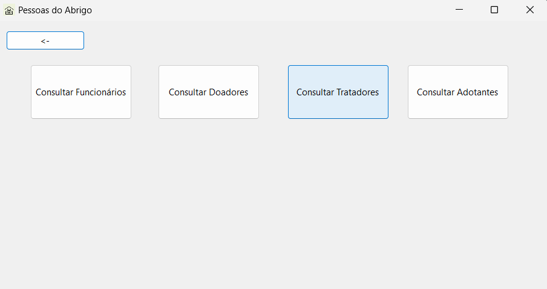

## Funcionalidade: Consultar Funcionário

Como antes descrito, esta funcionalidade oferece a capacidade de consultar todos os funcionários do abrigo.

```sql
CREATE VIEW SHOW_FUNCIONARIO AS     
    SELECT 
        Num_func, Nome,Horario,Telefone,Email,Endereco,NIF_Func
    FROM 
        Projeto_Funcionario
GO
```

Consultar Todos os Funcionário do Abrigo

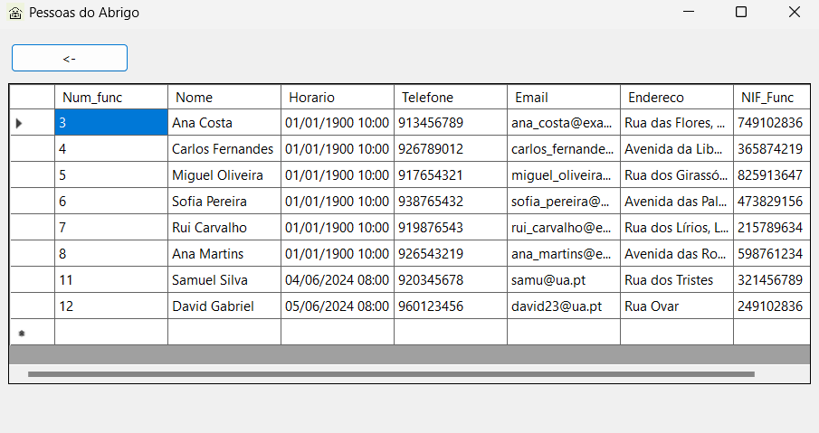

## Funcionalidade: Consultar Doador

Semelhante ao anterior, simplesmente existe a possibilidade de filtrar um doador em específico inserindo o seu número de doador e obtém-se uma view que apresenta todas as doações realizadas pelo mesmo. Esta funcionalidade é possível através de um cursor.

```sql
CREATE VIEW SHOW_DOADORES AS 
    SELECT 
        Num_Doador,Nome,Telefone,Email,Endereco,NIF_Doador
    FROM 
        Projeto_Doador 
GO

--View para mostrar as doações de um doador
CREATE VIEW SHOW_DOACOES_DOADOR AS 
    SELECT 
        pd.Num_Doador ,doacao.Tipo_Doacao, doacao.Quantidade, doacao.Data
    FROM 
        Projeto_Doador pd
    INNER JOIN 
        Projeto_Doacao doacao 
        ON 
        pd.NIF_Doador = doacao.Doador_NIF
GO
```

Consulta de todos Doadores do Abrigo:

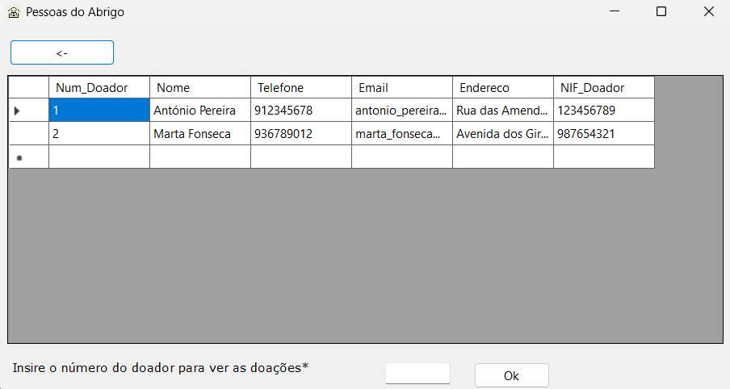


Consulta de Doações feitas por um doador:

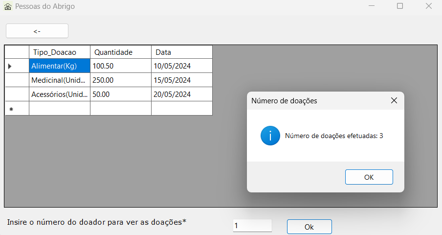

```sql
--Cursor que conta o número de doações de um doador
DECLARE @Num_Doador INT;
 DECLARE @n_doacoes INT;


 SET @Num_Doador = 1 ; --Valor teste este valor no forms é obtido através do input do utilizador

  DECLARE countCursor CURSOR FOR
      SELECT COUNT(*) AS N_DOACOES
      FROM SHOW_DOACOES_DOADOR WHERE Num_Doador = @Num_Doador;

              
  OPEN countCursor;


  FETCH NEXT FROM countCursor INTO @n_doacoes;

            
  CLOSE countCursor;
  DEALLOCATE countCursor;


  -- Usar o valor contado
  PRINT 'Número de Doacoes: ' + CAST(@n_doacoes AS VARCHAR);
```

## Funcionalidade: Consultar Tratador

Esta funcionalidade permite, então, visualizar todos os tratadores que operam no abrigo ou que têm alguma ligação com o mesmo. Posteriormente, se for selecionado um certo Num_Tratador, é mostrado todos os tratamentos que esse tratador em específico realizou enquanto desempenhava funções no abrigo. Esta amostra detalhada é possível através de um cursor.

```sql
CREATE VIEW SHOW_TRATADOR AS 
    SELECT 
        Num_tratador,Nome,Horario,Telefone,Email,Endereco,
    FROM 
        Projeto_Tratador
GO

-- View para ver os tratamentos por tratador
CREATE VIEW SHOW_TRATAMENTOS_TRATADOR AS 
    SELECT 
        pt.Num_tratador, 
        pt.Nome,
        tratamento.Tipo_Tratamento,
        pttta.Tratamento_Data, 
        pa.Nome_Animal, 
        pa.Num_chegada
    FROM 
        Projeto_Tratador pt
    INNER JOIN 
        Projeto_Tem_Tratamento_Tratador_Animal pttta 
        ON pt.NIF_Tratador = pttta.Tratador_NIF
    INNER JOIN 
        Projeto_Tratamento tratamento 
        ON tratamento.data = pttta.Tratamento_Data
    INNER JOIN 
        Projeto_Animal pa 
        ON pa.Num_chegada = pttta.Num_chegada
GO
```

Consultar todos os Tratadores do Abrigo: 

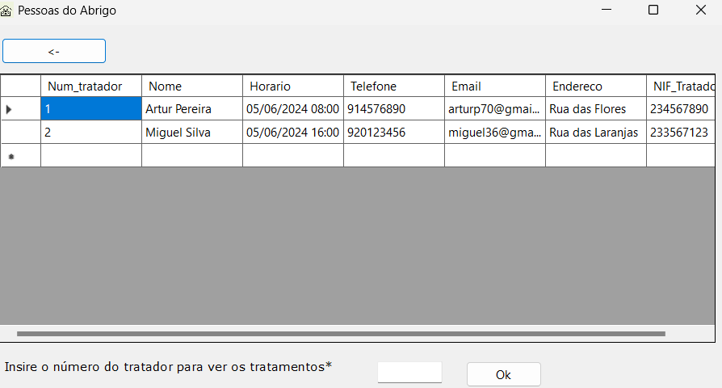


Consultar Tratamentos Registados de um Tratador:

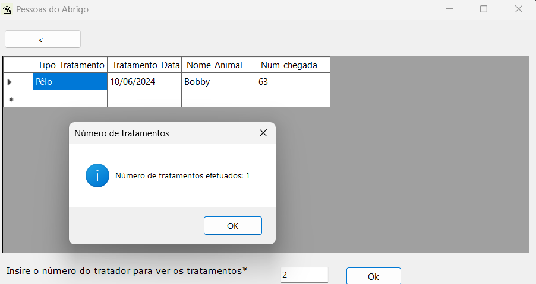

```sql	
 -- Cursor que conta o número de tratamentos por tratador
  

DECLARE @Num_Tratador INT;
 DECLARE @n_tratamentos INT;


 SET @Num_Tratador = 1 ; --Valor teste este valor no forms é obtido através do input do utilizador

  DECLARE countCursor CURSOR FOR
      SELECT COUNT(*) AS N_TRATAMENTOS
      FROM SHOW_TRATAMENTOS_TRATADOR WHERE Num_tratador = @Num_Tratador;

              
  OPEN countCursor;


  FETCH NEXT FROM countCursor INTO @n_tratamentos;

            
  CLOSE countCursor;
  DEALLOCATE countCursor;


  PRINT 'Número de Tratamentos: ' + CAST(@n_tratamentos AS VARCHAR);

```

## Funcionalidade: Consultar Adotante

Em seguimento das prévias consultas, através de uma view, é possível consultar a lista detalhada de todos os adotantes associados ao abrigo. Ao selecionar um Num_Adotante em específico, é possível verificar todas as adoções realizadas por este. Esta funcionalidade é possível através de um cursor.

```sql
-- View para ver todos os adotantes
CREATE VIEW SHOW_ADOTANTE AS 
    SELECT 
        Num_Adotante,Nome,Data_Adocao,Telefone,Email,Endereco,NIF_Adotante 
    FROM 
        Projeto_Adotante
GO


--View para ver as adoções de um adotante
CREATE VIEW SHOW_ADOCOES_ADOTANTE AS 
    SELECT 
        pa.Num_Adotante, animal.Num_chegada,animal.Nome_Animal, pa.Data_Adocao
    FROM 
        Projeto_Adotante pa 
    INNER JOIN Projeto_Animal animal 
        ON 
        pa.NIF_Adotante = animal.Adotante_NIF
GO
```

Consulta de todos os Adotantes do Abrigo:

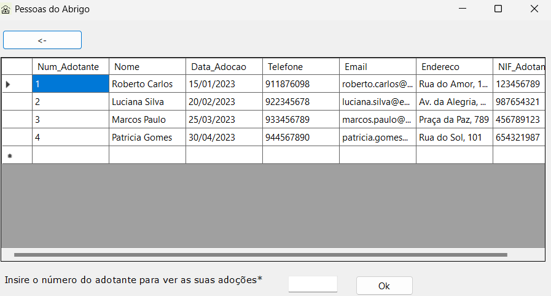


Consultar Adoções feitas por um Adotante:

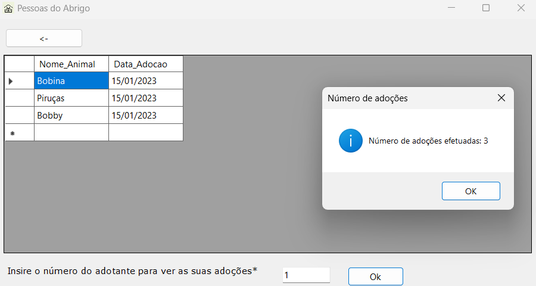

```sql
  -- Cursor que conta o número de adoções por adotante
  DECLARE @Num_Adotante INT;
 DECLARE @n_adocoes INT;


 SET @Num_Adotante = 1 ; --Valor teste este valor no forms é obtido através do input do utilizador

  DECLARE countCursor CURSOR FOR
      SELECT COUNT(*) AS N_Adocoes
      FROM SHOW_ADOCOES_ADOTANTE WHERE Num_adotante = @Num_Adotante;

              
  OPEN countCursor;


  FETCH NEXT FROM countCursor INTO @n_adocoes;

            
  CLOSE countCursor;
  DEALLOCATE countCursor;


  -- Usar o valor contado
  PRINT 'Número de Adoções: ' + CAST(@n_adocoes AS VARCHAR);
```

## Triggers

```sql
CREATE TRIGGER DeleteTratadorRelations
ON Projeto_Tratador
INSTEAD OF DELETE
AS
BEGIN
    DELETE FROM Projeto_Tem_Tratamento_Tratador_Animal WHERE Tratador_NIF IN (SELECT NIF_Tratador FROM deleted);

    DELETE FROM Projeto_Tratador WHERE NIF_Tratador IN (SELECT NIF_Tratador FROM deleted);


END
```

```sql
CREATE TRIGGER DeleteAnimalRelations
ON Projeto_Animal
INSTEAD OF DELETE
AS
BEGIN
    DELETE FROM Projeto_TEM_Desparasitacao WHERE Num_chegada IN (SELECT Num_chegada FROM deleted);
    DELETE FROM Projeto_Historial_Clinico WHERE Num_chegada IN (SELECT Num_chegada FROM deleted);
    DELETE FROM Projeto_Tem_Vacina WHERE Num_chegada IN (SELECT Num_chegada FROM deleted);
    DELETE FROM Projeto_Tem_Tratamento_Tratador_Animal WHERE Num_chegada IN (SELECT Num_chegada FROM deleted);

    DELETE FROM Projeto_Animal WHERE Num_chegada IN (SELECT Num_chegada FROM deleted);
END
```
Os triggers foram criados com o intuito de eliminar os valores das chaves estrangeiras associadas às chaves primárias de animal e tratador.


## Índices/Indexes

Com o objetivo de acelarar as consultas de leitura criámos 5 clustered indexes sobre as colunas de identificação de entidades (Num_Funcionario, Num_Tratador...) nas consultas(views) à nossa base de dados, para os dados filtrados/atualizados aparecerem ordenados.

[Index SQL](SQL/Index.sql "SQLFileQuestion")

## Transações

As transações são usadas com o intuito de garantir que as operações em questão sejam executadas com sucesso ou revertidas caso ocorra algum erro, isto é, garante que se houver um erro ao inserir dados em qualquer uma das tabelas, nenhuma das operações será efetuada.
São especialmente úteis para garantir consistência e a integridade dos dados.

No nosso projeto, usamos as transactions no processo de remoção de um animal falecido, em que é apagado de todas as tabelas que tenham conexão à tabela Projeto_Animal, excluindo a tabela que regista os tratamentos pelo qual o animal passou durante a sua vida. Também usamos na remoção de um funcionário/tratador aquando do despedimento/saída do mesmo.
Cada uma destas transações estão incluídas nas procedures de remoção de cada uma destas entidades, estando presentes no ficheiro das stored procedures.

No caso de remover o animal falecido usámos:

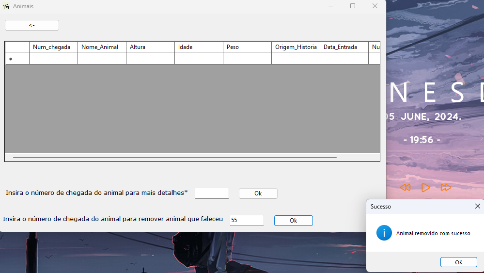
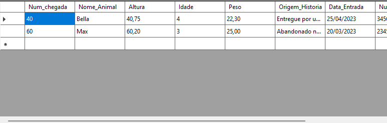

No caso de remover o funcionário/tratador usámos:

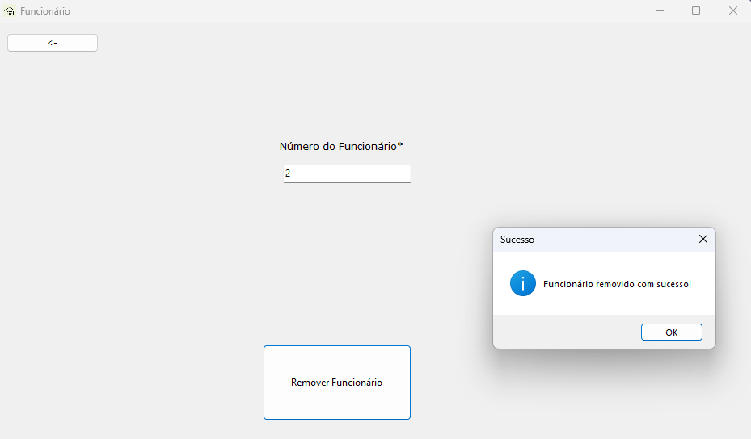
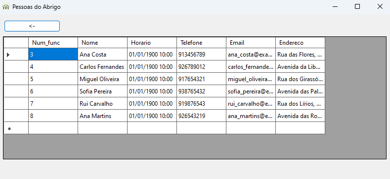

## SQL Programming: Stored Procedures, Triggers, UDF, Views, Transactions

[SQL SPs and Transactions File](SQL/Storedprocedures.sql "SQLFileQuestion")

[SQL Triggers File](SQL/Triggers.sql "SQLFileQuestion")

[SQL Views File](SQL/Views.sql "SQLFileQuestion")

[SQL UDF File](SQL/UDF.sql "SQLFileQuestion")

## Outras notas/Other notes

### Dados iniciais da dabase de dados/Database init data

[DDL File](SQL/DDL.sql "SQLFileQuestion")
